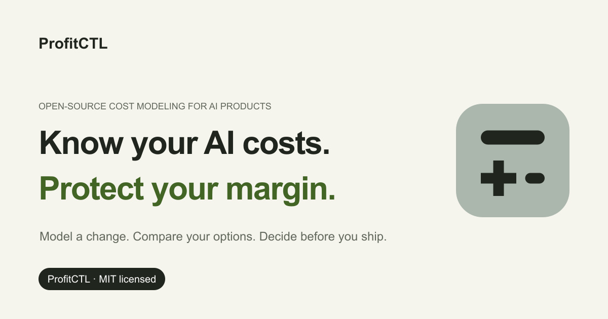

<p align="center">
  
</p>

<h1 align="center">ProfitCtl</h1>

<p align="center">
  <strong>Know your AI costs. Protect your margin.</strong><br>
  Cost modeling for teams building AI products.
</p>

<p align="center">
  A new feature changes more than the product. ProfitCtl helps you model the spend,<br>
  compare your options, and decide what to ship.<br><br>
  MIT licensed. Runs locally. No sign-up.
</p>

<p align="center">
  <a href="https://profitctl.com">Website</a> ·
  <a href="./docs/INSTALL.md">Install</a> ·
  <a href="./docs/DOCS_INDEX.md">Documentation</a> ·
  <a href="./benchmark_scenarios/README.md">Benchmark scenarios</a> ·
  <a href="./CONTRIBUTING.md">Contribute</a>
</p>



## From an assumption to a decision you can defend

1. **Start with what changes.** Describe usage, pricing, model calls, and infrastructure. Keep each cost tied to its source and assumptions.
2. **Put the options side by side.** Compare a feature, model, deployment, or pricing plan. See the effect on revenue, recurring margin, and cost per user.
3. **Set the limits before you ship.** Test margin and cost targets, including growth and tail risk. Keep the decision evidence in your review.

## Inspect the assumptions behind the answer

A cost estimate is useful when you can explain it. ProfitCtl keeps sources, confidence, and profitability targets alongside the result.

- **Use your own costs.** Save pricing, fixed and variable costs, usage, and targets in a YAML scenario.
- **Check growth and risk.** Use simulations and growth scenarios to test margin and cost limits.
- **Give agents grounded inputs.** Use `assess` and the bundled cost-aware skill when a codebase needs a starter cost model.

## Bring one real decision

Start with a saved comparison. Then replace the assumptions with your own costs and usage. This source-based example requires Git and Go:

```bash
git clone https://github.com/IntelIP/ProfitCtl.git
cd ProfitCtl
go run . compare examples/hybrid_steady_profit.yml examples/hybrid_profit.yml
```

You will see revenue, recurring revenue, fees, booked and operating margins, cost per user, covenant results, and the leaders for each metric. For the signed release binary and Bun package, see the [Install Guide](./docs/INSTALL.md). Pin the evaluator prerelease `v0.4.0-rc.1`; GitHub's latest-release endpoint selects stable releases.

## Use it where your team makes decisions

| Surface | Start here |
| --- | --- |
| Local CLI | [`simulate`, `compare`, and `validate`](./docs/QUICK_START.md) |
| Cost-aware agent decisions | [ProfitCtl cost-aware skill](./skills/profitctl-cost-aware/SKILL.md) |
| CI checks | [Cost model standards](./docs/cost-model-standards.md) |
| Scenario examples | [Benchmark scenarios](./benchmark_scenarios/README.md) |

The open-source local CLI, Codex skill, and CI output are available today. Hosted workspaces, saved team history, and approvals are planned. Website examples use fictional scenarios and sample costs; real decisions need your own rates, usage, and evidence.

## Production economics planning

Inspect service evidence, identify missing measurements, and compare explicitly modeled downstream effects with the new local `system` commands. Start with the [Condere walkthrough](./examples/system/README.md) and [system design](./docs/design/system-economics-v1.md). Synthetic examples are not production cost forecasts.

## Learn more

- [Documentation index](./docs/DOCS_INDEX.md)
- [How ProfitCtl works](./docs/HOW_IT_WORKS.md)
- [Architecture](./docs/ARCHITECTURE.md)
- [Cost intelligence system design](./docs/cost-intelligence-system-design.md)
- [Open-source company plan](./docs/OPEN_SOURCE_COMPANY_PLAN.md)
- [ProfitCtl plugin pilot](./docs/PROFITCTL_PLUGIN_PILOT_SPEC.md)
- [Website source](./website/README.md)
- [Release downloads](https://github.com/IntelIP/ProfitCtl/releases)

## Trust and participation

Developed by IntelIP and Hudson Aikins. ProfitCtl is MIT licensed. See [LICENSE](./LICENSE), [NOTICE](./NOTICE), [Trademark Guidelines](./TRADEMARKS.md), [Security](./SECURITY.md), and [Contributing](./CONTRIBUTING.md).
