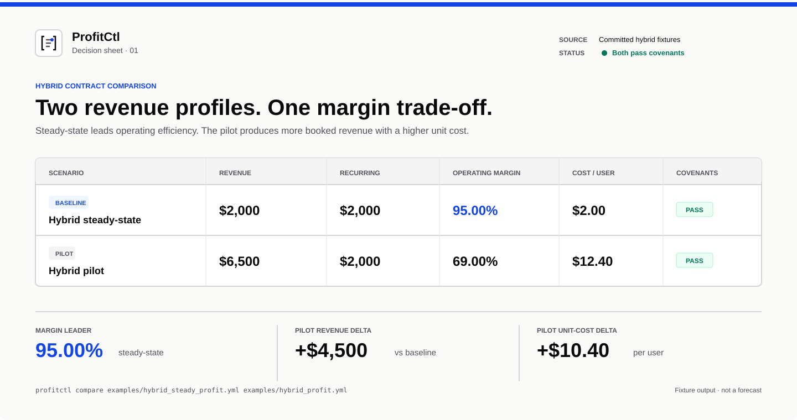

<p align="center">
  
</p>

# ProfitCtl

<p align="center">
  <strong>Unit economics as code for AI-native teams.</strong><br>
  Compare pricing, infrastructure, and AI spend before it ships.
</p>

<p align="center">
  <a href="./docs/INSTALL.md">Install</a> ·
  <a href="#quick-start">Run an example</a> ·
  <a href="./docs/DOCS_INDEX.md">Documentation</a> ·
  <a href="./benchmark_scenarios/README.md">Benchmark scenarios</a> ·
  <a href="./CONTRIBUTING.md">Contribute</a>
</p>



## What ProfitCtl does

- **Compare decisions before commitment.** Evaluate pricing, infrastructure, model, API, and contract choices side by side.
- **Model recurring-margin risk.** Simulate growth and stress, then test explicit profitability covenants.
- **Make cost assumptions inspectable.** Track fixed and variable costs, payment fees, calibration inputs, and source provenance.
- **Give agents grounded inputs.** Use `assess` and the bundled cost-aware skill when a codebase needs a starter cost model.

## Quick start

Run the committed hybrid comparison locally:

```bash
git clone https://github.com/IntelIP/ProfitCtl.git
cd ProfitCtl
go run . compare examples/hybrid_steady_profit.yml examples/hybrid_profit.yml
```

You will see revenue, recurring revenue, fees, booked and operating margins, cost per user, covenant results, and the leaders for each metric. For the release binary and private Bun package, see the [Install Guide](./docs/INSTALL.md).

## Use it where decisions happen

| Surface | Start here |
| --- | --- |
| Local CLI | [`simulate`, `compare`, and `validate`](./docs/QUICK_START.md) |
| Cost-aware agent decisions | [ProfitCtl cost-aware skill](./skills/profitctl-cost-aware/SKILL.md) |
| CI checks | [Cost model standards](./docs/cost-model-standards.md) |
| Scenario examples | [Benchmark scenarios](./benchmark_scenarios/README.md) |

## Learn more

- [Documentation index](./docs/DOCS_INDEX.md)
- [How ProfitCtl works](./docs/HOW_IT_WORKS.md)
- [Architecture](./docs/ARCHITECTURE.md)
- [Cost intelligence system design](./docs/cost-intelligence-system-design.md)
- [Open-source company plan](./docs/OPEN_SOURCE_COMPANY_PLAN.md)
- [ProfitCtl plugin pilot](./docs/PROFITCTL_PLUGIN_PILOT_SPEC.md)
- [Website source](./website/README.md)
- [Release downloads](https://github.com/IntelIP/ProfitCtl/releases)

## Trust and participation

ProfitCtl is MIT licensed. See [LICENSE](./LICENSE), [NOTICE](./NOTICE), [Trademark Guidelines](./TRADEMARKS.md), [Security](./SECURITY.md), and [Contributing](./CONTRIBUTING.md).
